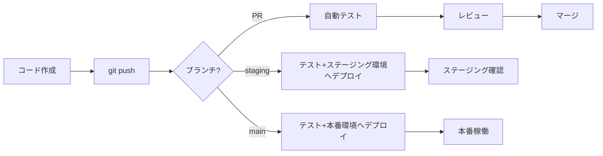

# 🚀 Todoアプリケーション - CI/CD 対応版

このプロジェクトは、GitHub Actionsを使用した完全自動化CI/CDパイプラインを備えています。

## ✨ 特徴

- 🔄 **自動テスト**: プルリクエスト作成時に自動テスト実行
- 🚀 **自動デプロイ**: ブランチへのpush時に自動デプロイ
- 🧪 **コード品質チェック**: PHPUnit、Jest、Laravel Pintによる自動チェック
- 📦 **最適化されたビルド**: 本番環境用に最適化されたビルド
- 🔐 **セキュアな認証**: SSH鍵ベースの安全なデプロイ
- 📊 **透明性**: GitHub Actionsで全プロセスを可視化

## 🎯 CI/CDフロー



## 📁 プロジェクト構成

```
todo/
├── .github/
│   └── workflows/              # GitHub Actions ワークフロー
│       ├── test.yml           # テストワークフロー（PR時）
│       ├── deploy-staging.yml # ステージングデプロイ
│       └── deploy-production.yml # 本番デプロイ
├── docs/
│   ├── CI_CD_SETUP.md         # 詳細セットアップガイド
│   └── QUICK_START_CI_CD.md   # クイックスタートガイド
├── todo-app/
│   ├── backend/               # Laravel バックエンド
│   ├── frontend/              # React フロントエンド
│   └── scripts/               # デプロイスクリプト
│       ├── deploy-backend.sh
│       ├── deploy-frontend.sh
│       ├── setup-server.sh
│       └── local-test.sh
└── README_CI_CD.md            # このファイル
```

## 🚀 クイックスタート

### 1分で理解する使い方

```bash
# 1. 機能開発
git checkout -b feature/new-feature
# コードを編集...
git add .
git commit -m "Add new feature"
git push origin feature/new-feature

# 2. プルリクエスト作成
# → GitHubでPRを作成すると、自動的にテストが実行される

# 3. ステージング環境へデプロイ
git checkout staging
git merge feature/new-feature
git push origin staging
# → 自動的にステージング環境へデプロイ！

# 4. 本番環境へデプロイ
git checkout main
git merge staging
git push origin main
# → 自動的に本番環境へデプロイ！
```

### 初回セットアップ

1. **サーバーの準備** → [クイックスタートガイド](docs/QUICK_START_CI_CD.md)
2. **GitHub Secretsの設定** → [セットアップガイド](docs/CI_CD_SETUP.md)
3. **デプロイ実行** → `git push`するだけ！

## 📋 ワークフローの詳細

### テストワークフロー (`test.yml`)

**トリガー:** プルリクエスト作成時

**実行内容:**
- ✅ PHPUnitテスト（Laravel）
- ✅ Jestテスト（React）
- ✅ コード品質チェック（Laravel Pint）
- ✅ ビルドチェック

### ステージングデプロイ (`deploy-staging.yml`)

**トリガー:** `staging` ブランチへのpush

**実行内容:**
- ✅ 全テスト実行
- ✅ 依存関係のインストール
- ✅ ステージング用ビルド
- ✅ サーバーへSSH接続
- ✅ 自動デプロイ

### 本番デプロイ (`deploy-production.yml`)

**トリガー:** `main` ブランチへのpush

**実行内容:**
- ✅ 全テスト実行
- ✅ 本番用最適化ビルド
- ✅ サーバーへSSH接続
- ✅ バックアップ作成
- ✅ 自動デプロイ
- ✅ ヘルスチェック

## 🛠️ ローカルテスト

デプロイ前にローカルでテストを実行：

```bash
cd todo-app/scripts
chmod +x local-test.sh
./local-test.sh
```

これにより、CI/CDパイプラインと同じテストがローカルで実行されます。

## 📊 デプロイの確認

### GitHub Actionsで確認

1. GitHubリポジトリの **Actions** タブを開く
2. 実行中/完了したワークフローを確認
3. 各ステップの詳細ログを表示

### サーバーで確認

```bash
# サーバーにSSH接続
ssh deploy@your-server.com

# Laravelログ確認
tail -f /var/www/todo-app/backend/storage/logs/laravel.log

# デプロイログ確認
tail -f /var/www/todo-app/backend/deploy.log
```

## 🔐 セキュリティ

- 🔑 SSH鍵認証による安全なデプロイ
- 🔒 GitHub Secretsで機密情報を管理
- 🛡️ テスト成功時のみデプロイ実行
- 📝 すべての操作をログに記録

## 📈 推奨ブランチ戦略

```
develop  → staging  → main
  ↓         ↓         ↓
開発    ステージング  本番
```

1. **develop**: 開発中の機能（デプロイなし）
2. **staging**: テスト環境（自動デプロイ）
3. **main**: 本番環境（自動デプロイ）

## 🆘 トラブルシューティング

### デプロイが失敗する

```bash
# GitHub Actionsのログを確認
# https://github.com/yourusername/yourrepo/actions

# サーバーのログを確認
ssh deploy@your-server.com
tail -n 100 /var/www/todo-app/backend/storage/logs/laravel.log
```

### よくあるエラーと解決策

| エラー | 解決策 |
|-------|--------|
| Permission denied | [解決方法](docs/CI_CD_SETUP.md#パーミッションエラー) |
| SSH接続失敗 | [解決方法](docs/CI_CD_SETUP.md#ssh接続エラー) |
| テスト失敗 | ローカルで`./scripts/local-test.sh`を実行 |
| ビルドエラー | `npm install`または`composer install`を再実行 |

## 📚 ドキュメント

- 📖 [詳細セットアップガイド](docs/CI_CD_SETUP.md) - 完全な手順とトラブルシューティング
- ⚡ [クイックスタートガイド](docs/QUICK_START_CI_CD.md) - 5ステップでCI/CD構築
- 🔧 [デプロイスクリプト解説](todo-app/scripts/) - 各スクリプトの詳細

### CI/CDとは？

**CI (Continuous Integration):**
- コードをpush → 自動テスト実行
- コード品質を自動チェック
- 問題を早期発見

**CD (Continuous Deployment):**
- テスト成功 → 自動デプロイ
- 手動作業を削減
- 一貫性のあるデプロイ

### メリット

1. ⚡ **デプロイの高速化** - pushするだけで自動デプロイ
2. 🐛 **バグの早期発見** - 自動テストで問題を即座に検出
3. 🔄 **継続的な改善** - 小さな変更を頻繁にデプロイ
4. 👥 **チーム協調** - 誰でも安全にデプロイ可能
5. 📊 **透明性** - すべてのプロセスが可視化